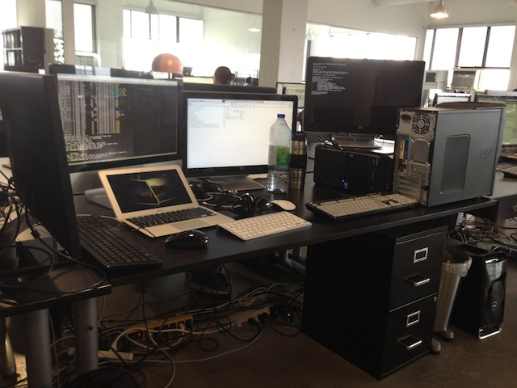
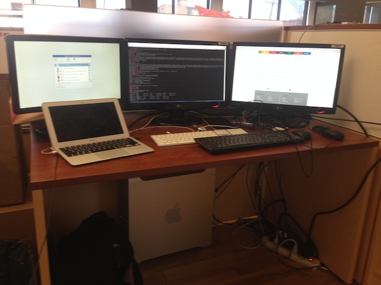

My workspace about a year ago and now.

---

Workspace Retrospective
=======================

Last year it looked like this:

And now:

The curious thing is that there's actually more devices on the last photo
(there are two [Arduinos][arduino] on the table, a [Beaglebone Black][bbb]
and a [Raspberry Pi][pi] behind the monitors), the stuff is just getting
smaller. Which seems like a common trend in technology though.

[arduino]: http://en.wikipedia.org/wiki/Arduino
[bbb]: http://en.wikipedia.org/wiki/BeagleBoard#BeagleBone_Black
[pi]: http://en.wikipedia.org/wiki/Raspberry_Pi
